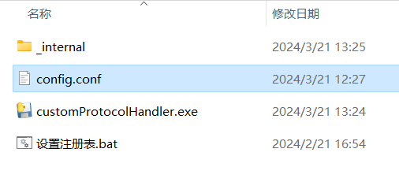
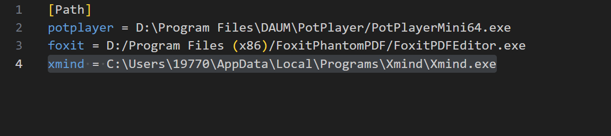
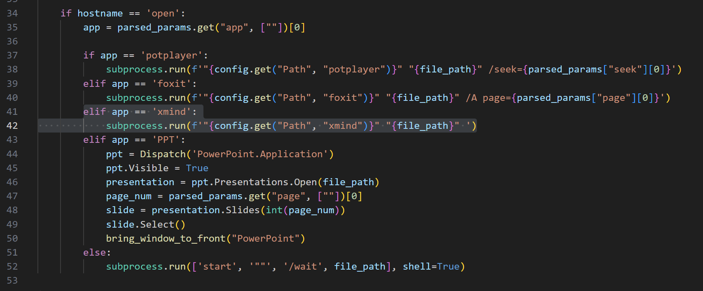
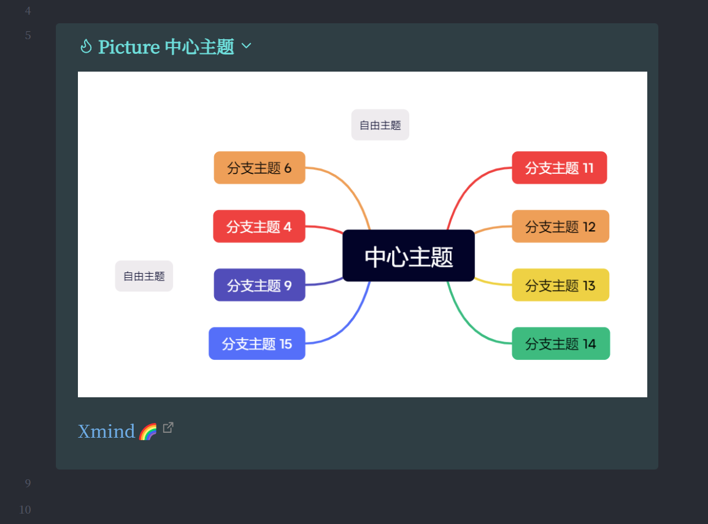
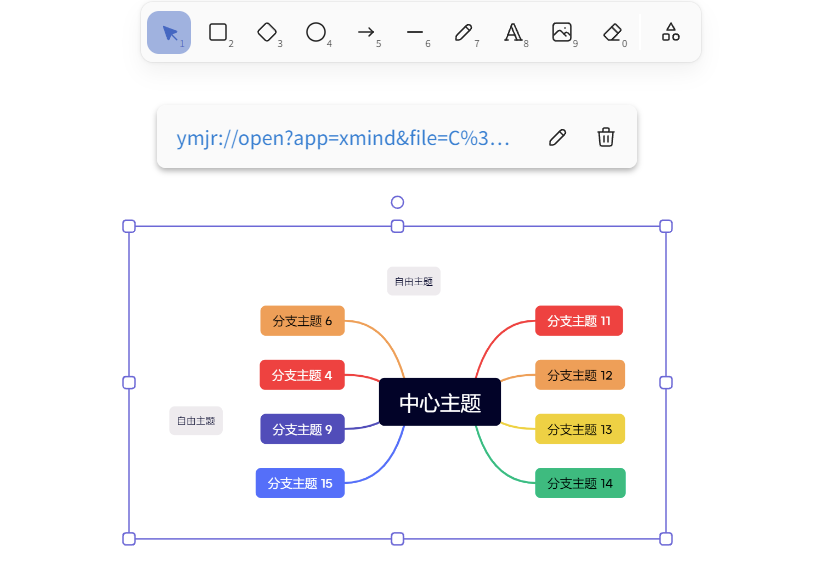
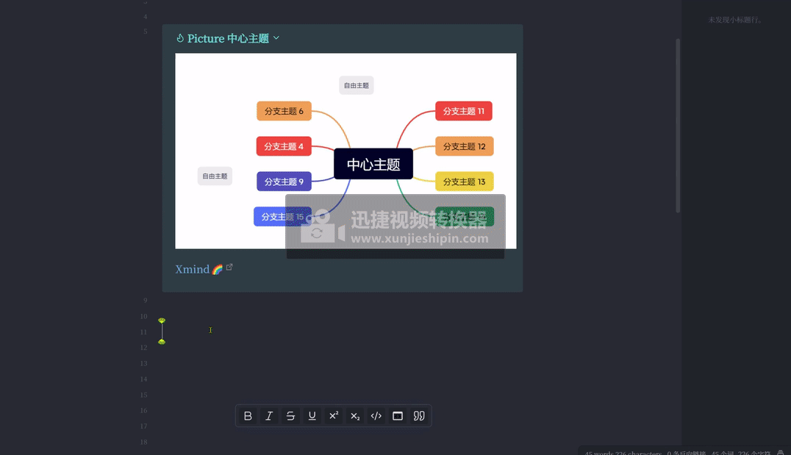
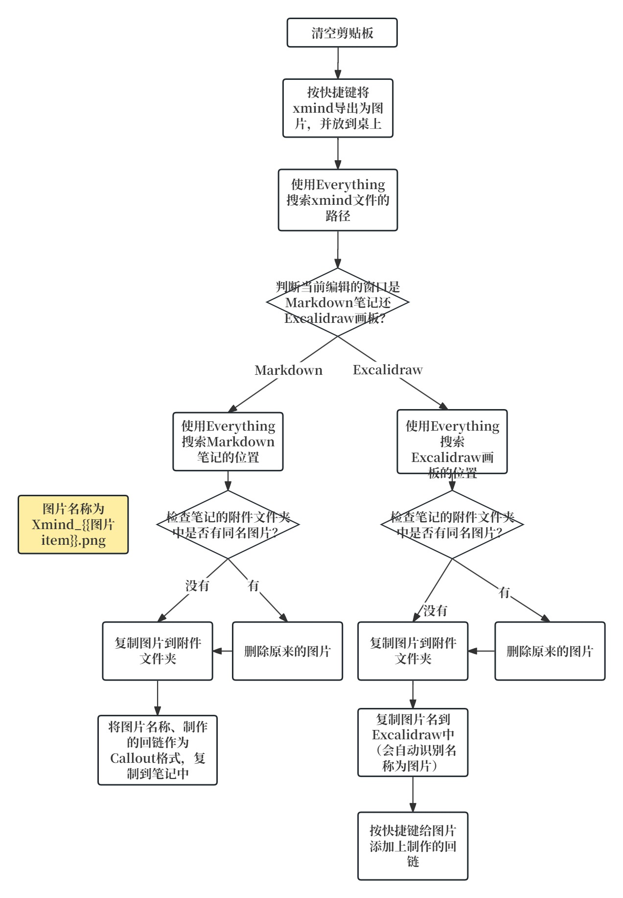
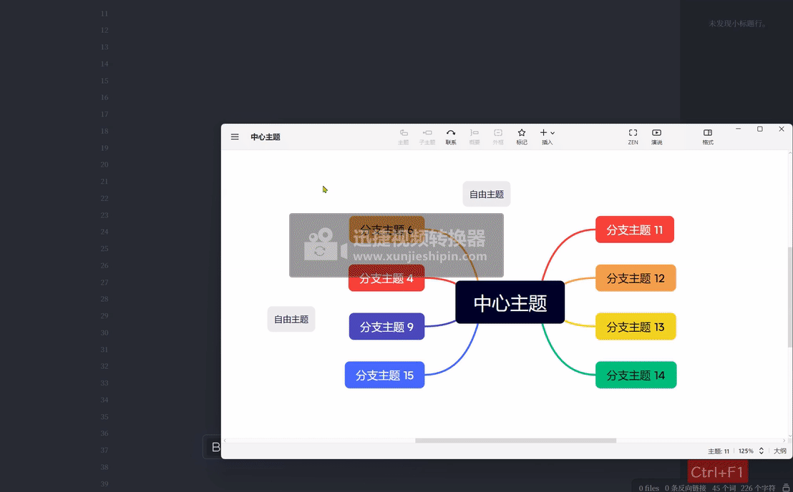

# Xmind-Obsidian

用Quicker可以帮助我们完成一些繁琐的、需要多个操作步骤的动作。

这篇文章中，我用Quicker将的Xmind导出的思维导图图片复制到到Obsidian文件夹、并制作回链且按照callout格式复制到Obsidian笔记中，使之点击Obsidian中的链接能自动打开xmind导图。

之前的BookxNote、Zotero、Eagle，它们三者的共同点是，在软件安装时，就已经在注册表中注册了相关的回链协议。

例如当链接为`eagle://`、`eagle://item/LUJ9441DVAFRL`，系统能识别并自动打开Eagle软件。前者代表只打开Eagle软件，后者带item参数，能打开Eagle软件同时跳转到对应的图片位置。BookxNote和Zotero同理。

上二篇文章介绍了PotPlayer、PowerPoint的回链协议，这篇文章介绍一下Xmind的回链协议。

前几天，我在刷B站视频时，看到了大佬一鸣惊人_001的视频：[摘录视频、PDF、PPT到Obsidian和Excalidraw的配置教程 -- 一键摘录内容，点击回链跳回原文\_哔哩哔哩\_bilibili](https://www.bilibili.com/video/BV1qH4y1j7Q6/?spm_id_from=333.999.0.0)，里面详细介绍了生成摘录信息、处理摘录信息、响应回链三个部分。由于生成摘录信息和处理摘录信息我用Quicker替代了，因此大家只需要下载响应回链部分就可。这是大佬的github仓库地址[GitHub - Bowen-0x00/CustomProtocolHandler: CustomProtocolHandler是一个用于处理自定义协议的工具，旨在实现处理自定义协议链接回链。方便通过笔记软件进行知识管理。如点击自定义协议链接时能够跳回原位，包括但不限于视频、PPT和PDF。](https://github.com/Bowen-0x00/CustomProtocolHandler/releases)

需要注意的是，从大佬那里下载的CustomProtocolHandler，只带有PotPlayer、PowerPoint、foxit的回链协议。如果要用这篇文章里的**xmind回链**，需要自己**下载源码**，在里面**添加xmind的回链协议**，并**打包为程序**（不想打包也可以用其他方法，好像是指定python的路径，但我不会）。

首先在config.conf中修改xmind安装的程序的路径，没有的话就添加一个。

例如修改（添加）路径为：

然后在源码customProtocolHandler.py中，按下图添加xmind的回链协议。并打包为程序，打包教程可以参考：[README](https://github.com/Bowen-0x00/CustomProtocolHandler/blob/main/docs/README_ZH.md)

最后右键以管理员身份运行“设置注册表.bat”，在电脑的注册表里添加自动以回链协议。在运行前，把这几个文件放在一个固定位置，移动过的话需要重新以管理员身份运行一下（我是小白，也不太清楚，一般不会出问题）。

注：上述步骤可以自定义任何软件，**可以为任何软件设置回链**，点击链接能跳转到软件。

Xmind的回链：`ymjr://open?app=xmind&file=文件路径`，点击后就能打开xmind文件，如果上一步响应回链部分配置没问题的话。但如果**源xmind文件的路径**移动过的话，是无法打开该xmind文件的。

摘录xmind图片到Obsidian中Markdown的样式：

摘录xmind图片到Obsidian中Excalidraw的样式：

点击Markdown或Excalidraw中的链接能跳转到xmind文件：

制作Quicker动作的思路：

其中，当“检查笔记的附件文件夹中是否有同名图片？”为“有”时，删除原来的图片，复制新的图片到附件文件夹。这样的话就能达到当更改Xmind思维导图后，Obsidian里的图片也跟着更新的目的。

使用的方法：

首先用Quicker的模拟按键功能**按快捷键导出png图片到桌面**（快捷键在Xmind软件中设置）。但我发现“**模拟按键B（参数）**”这个动作无法导图xmind的图片，不知道为什么。所以大家记得使用“**模拟按键A（录入）**”来录入导出图片的快捷键。

导出图片到桌面后，就可以到Obsidian里，按ctrl+v。会自动复制图片到附件文件夹，并且自动粘贴回链。

我平时用Obsidian和Typora编辑文档，因此动作中加了识别Typora窗口的部分。

我将Quicker动作、不同的摘录情况的调试运行详情放到了[github仓库](https://github.com/operations4304/Xmind-Obsidian)

**但不幸的是，如果您直接用肯定是没法用的**。因为时间精力有限，没法做成普遍适用的动作。

所以这里提供的是实现的思路，以及可以参考的某些步骤的动作的写法。

如果你对图片的复制方式不清楚，可以查看这篇文章，[附件管理方式](https://zhuanlan.zhihu.com/p/690376509)，介绍了附加的储存情况。

谢谢观看！
